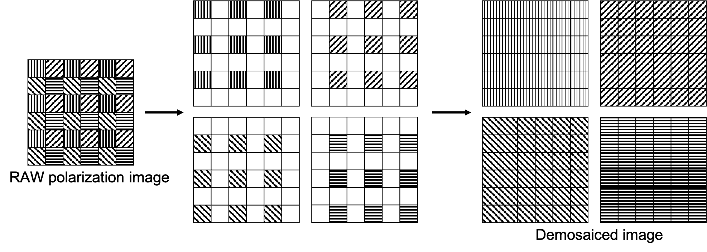
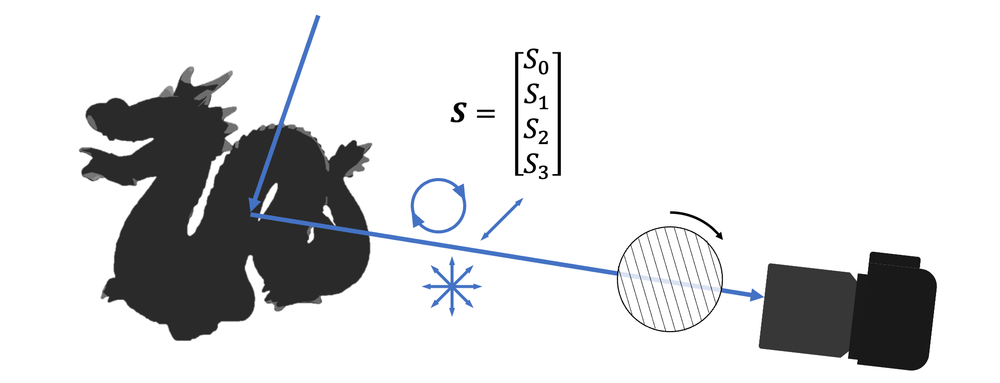
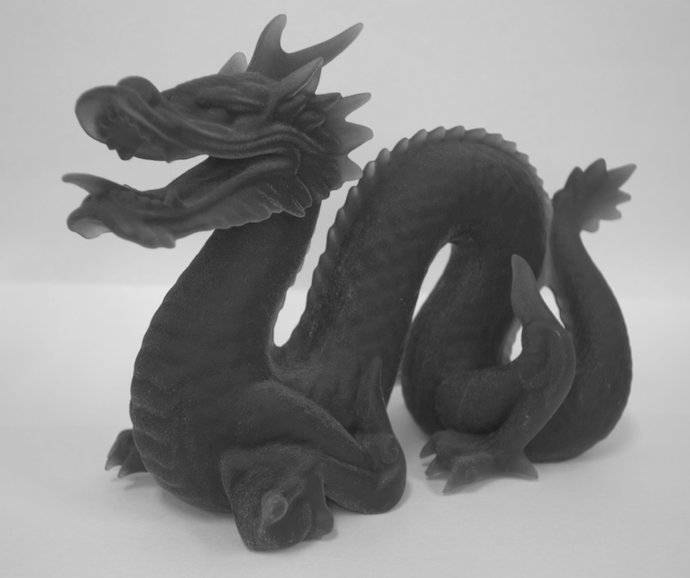
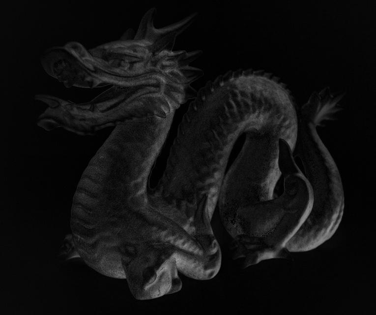
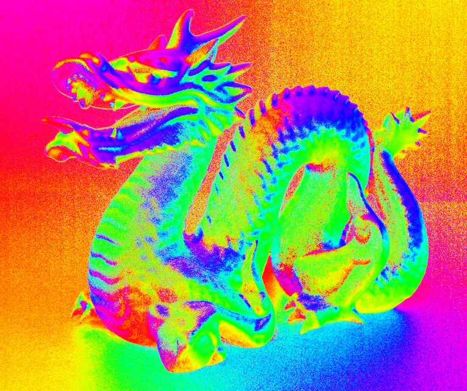
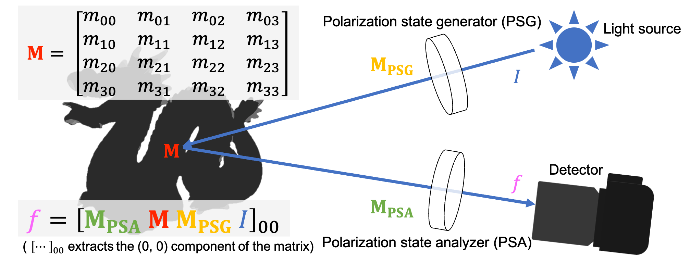
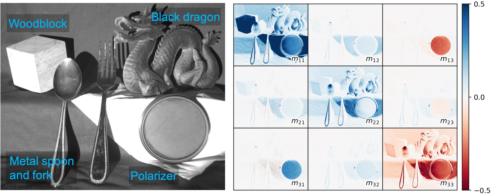

<p align="center">
    
</p>

---

Polanalyser is polarization image analysis tool.

## Key Features

- [Demosaicing of a image captured by a polarization image sensor](#polarization-demosaicing)
  - Both Monochrome/Color Polarization image sensors (*e.g.*, IMX250MZR / MYR) are supported
  - Three algorithms are implemented; Bilinear, Variable Number of Gradients (VNG), Edge-Aware (EA)
- [Analysis of Stokes vector](#analysis-of-stokes-vector)
  - Calculate Stokes vector from an image of a polarization camera
  - Convert Stokes vector to meaningful parameters, such as Degree of Linear Polarization (DoLP), Angle of Linear Polarization (AoLP)
- [Analysis of Mueller matrix](#analysis-of-mueller-matrix)
  - Calculate Mueller matrix from images captured under a variety of polarimetric conditions
  - Provide basic Mueller matrix
- Visualizing a polarimetric image
  - Apply colormap to AoLP image
  - Plot Mueller matrix image

## Polarization Image Dataset

Dataset of images captured by a polarization camera (FLIR, BFS-U3-51S5P-C) is available.

[**[Click here to download the dataset (Google Drive)]**](https://drive.google.com/drive/folders/1vCe9N05to5_McvwyDqxTmLIKz7vRzmbX?usp=sharing)

## Requirement and Installation

- Numpy
- OpenCV
- matplotlib

```sh
pip install git+https://github.com/elerac/polanalyser
```

## Usage

### Polarization demosaicing

Demosaic  raw polarization image captured with a polarization sensor (*e.g.*, [IMX250MZR / MYR](https://www.sony-semicon.com/en/products/is/industry/polarization.html)).

<picture>
  <source media="(prefers-color-scheme: dark)" srcset="documents/demosaicing_dark.png">
  <source media="(prefers-color-scheme: light)" srcset="documents/demosaicing_light.png">
  
</picture>

```python
import cv2
import polanalyser as pa

img_raw = cv2.imread("dataset/dragon.png", 0)

img_demosaiced = pa.demosaicing(img_raw, pa.COLOR_PolarMono)

img_000, img_045, img_090, img_135 = cv2.split(img_demosaiced)
```

### Analysis of Stokes vector

[**Stokes vector**](https://en.wikipedia.org/wiki/Stokes_parameters) describes the polarization states. We can measure these values by using a *linear polarizer* (To measure the circular polarization S3, we also need to use a *retarder*).

<picture>
  <source media="(prefers-color-scheme: dark)" srcset="documents/stokes_setup_dark.png">
  <source media="(prefers-color-scheme: light)" srcset="documents/stokes_setup_light.png">
  
</picture>

Stokes vector can be converted to meaningful values. *Degree of Linear Polarization* (DoLP) represents how much the light is polarized. The value is 1 for perfectly polarized light and 0 for unpolarized light. *Angle of Linear Polarization* (AoLP) represents the polarization angle of the incident light relative to the camera sensor axis. The value ranges from 0 to 180 degrees.

```python
import cv2
import numpy as np
import polanalyser as pa

# Read image and demosaicing
img_raw = cv2.imread("dataset/dragon.png", 0)
img_demosaiced = pa.demosaicing(img_raw)
img_000, img_045, img_090, img_135 = cv2.split(img_demosaiced)

# Calculate the Stokes vector per-pixel
image_list = [img_000, img_045, img_090, img_135]
angles = np.deg2rad([0, 45, 90, 135])
img_stokes = pa.calcStokes(image_list, angles)

# Decompose the Stokes vector into its components
img_s0, img_s1, img_s2 = cv2.split(img_stokes)

# Convert the Stokes vector to Intensity, DoLP and AoLP
img_intensity = pa.cvtStokesToIntensity(img_stokes)
img_dolp = pa.cvtStokesToDoLP(img_stokes)
img_aolp = pa.cvtStokesToAoLP(img_stokes)
```

||Example of results | |
|:-:|:-:|:-:|
|Intensity|DoLP|AoLP|
||||

What do the colors in the AoLP image represent? [See the wiki for details](https://github.com/elerac/polanalyser/wiki/How-to-Visualizing-the-AoLP-Image).

### Analysis of Mueller matrix

[**Mueller matrix**](https://en.wikipedia.org/wiki/Mueller_calculus) represents the change of the polarization state of light. The matrix size is 4x4 (When we consider only linear polarization, the size is 3x3).

We can measure the unknown Mueller matrix by changing the polarization state of both the light and the detector. The following figure shows a schematic diagram to measure the unknown Mueller matrix **M**.

<picture>
  <source media="(prefers-color-scheme: dark)" srcset="documents/mueller_setup_dark.png">
  <source media="(prefers-color-scheme: light)" srcset="documents/mueller_setup_light.png">
  
</picture>

*I* denotes the intensity of the unpolarized light source. **M_PSG** and **M_PSA** represent the Polarization state generator and analyzer (PSG and PSA) in Mueller matrix form. PSG and PSA are commonly composed of the basic optical elements (i.e., linear polarizer and retarder).
The detector measures the intensity *f* expressed by *f* = [ **M_PSA** **M** **M_PSG** *I* ]00. [...]00 extracts the (0, 0) component of the matrix.

Measuring *f* by changing many combinations of **M_PSG** and **M_PSA** can estimate the unknown Mueller matrix **M** with a linear least-squares method.

The following code shows the example to estimate the 3x3 Mueller matrix image.

```python
import cv2
import polanalyser as pa

# Read all images
path = "dataset/mueller/various3x3"
pcontainer = pa.PolarizationContainer(path)
image_list = pcontainer.get_list("image")
mueller_psg_list = pcontainer.get_list("mueller_psg")
mueller_psa_list = pcontainer.get_list("mueller_psa")

print(len(pcontainer))  # 16
print(image_list[0].shape)  # (2048, 2448)
print(mueller_psg_list[0].shape)  # (3, 3)
print(mueller_psa_list[0].shape)  # (3, 3)

# Calculate Mueller matrix
img_mueller = pa.calcMueller(image_list, mueller_psg_list, mueller_psa_list)

print(img_mueller.shape)  # (2048, 2448, 3, 3)

# Visualize Mueller matrix image
pa.plotMueller("plot_mueller.png", img_mueller, vabsmax=2.0)
```


