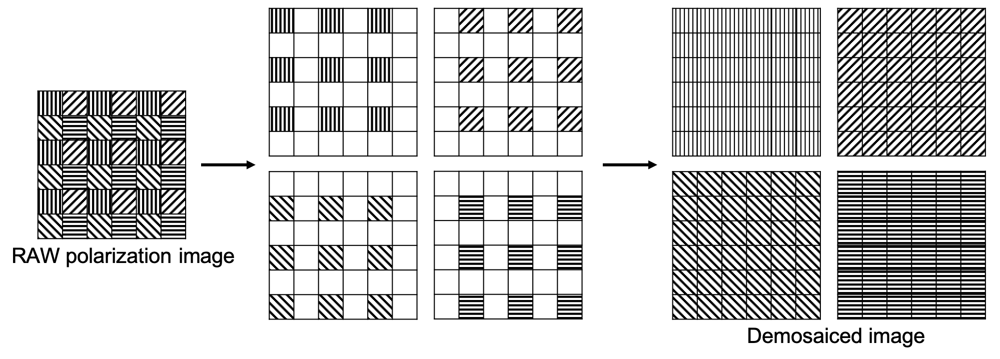

# Polanalyser
Polanalyser is polarization image analysis tool.

It can be used for 
* [Demosaicing of bayer images taken with a polarization camera](#polarization-demosaicing)
* [Analysis of Stokes vector](#analysis-of-stokes-vector)
* [Analysis of Mueller matrix](#analysis-of-mueller-matrix)

Limitation: Currently, **only linear polarization** is assumed, and circular polarization is not taken into account.

## Requirement
* OpenCV
* Numpy
* [Numba](https://github.com/numba/numba)

## Installation
```sh
pip install git+https://github.com/elerac/polanalyser
```

## Polarization image dataset
You can download a sample of polarization images taken with Sony IMX250MZR sensor (FLIR, BFS-U3-51S5P-C) [here](https://drive.google.com/drive/folders/1vCe9N05to5_McvwyDqxTmLIKz7vRzmbX?usp=sharing).

## Usage
### import 
```python
import polanalyser as pa
```

### Polarization demosaicing
Demosaic raw polarization image taken with the [IMX250MZR](https://www.sony-semicon.co.jp/e/products/IS/polarization/product.html) sensor.

```python
import cv2
import polanalyser as pa

img_raw = cv2.imread("IMX250MZR/dragon.png", 0)

img_demosaiced = pa.demosaicing(img_raw)

img_0, img_45, img_90, img_135 = cv2.split(img_demosaiced)
```

### Analysis of Stokes vector
The [**Stokes vector**](https://en.wikipedia.org/wiki/Stokes_parameters) (or parameters) are a set of values that describe the polarization state. You can get these values by taking at least three images while rotating the polarizer (If you want to take into account circular polarization, you need to add measurements with a retarder).

The Stokes vector can be converted to meaningful values. **Degree of Linear Polarization** (DoLP) represents how much the light is polarized. The value is 1 for perfectly polarized light and 0 for unpolarized light. **Angle of Linear Polarization** (AoLP) represents the polarization angle of the incident light relative to the camera sensor axis. The value ranges from 0 to 180 degrees.
```python
import cv2
import numpy as np
import polanalyser as pa

img_raw = cv2.imread("IMX250MZR/dragon.png", 0)
img_demosaiced = pa.demosaicing(img_raw)

radians = np.array([0, np.pi/4, np.pi/2, np.pi*3/4])
img_stokes = pa.calcStokes(img_demosaiced, radians)

img_S0, img_S1, img_S2 = cv2.split(img_stokes)

img_intensity = img_S0/2
img_DoLP = pa.cvtStokesToDoLP(img_stokes)
img_AoLP = pa.cvtStokesToAoLP(img_stokes)
```

||Example of results | |
|:-:|:-:|:-:|
|Intensity (S0/2.0)|DoLP|AoLP|
||||

### Analysis of Mueller matrix
[Mueller matrix](https://en.wikipedia.org/wiki/Mueller_calculus)

```python
import cv2
import numpy as np
import polanalyser as pa

#TBA
```
