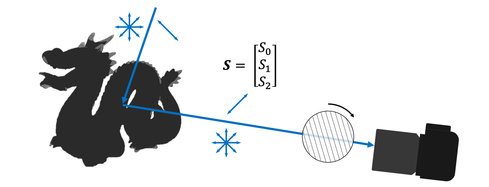

# Polanalyser
Polanalyser is polarization image analysis tool.

It can be used for 
* Demosaicing of bayer images taken with a polarization camera
* Analysis of Stokes vector
* Analysis of Mueller matrix

Currently, only linear polarization is assumed, and circular polarization is not taken into account.

## Requirement
* OpenCV
* Numpy
* Numba

## Polarization image dataset
You can download a sample of polarization images taken with Sony IMX250MZR sensor (FLIR, BFS-U3-51S5P-C) [here](https://drive.google.com/drive/folders/1vCe9N05to5_McvwyDqxTmLIKz7vRzmbX?usp=sharing).

## Usage
### import 
```python
import polanalyser as pa
```

### Polarization demosaicing
Demosaic monochrome polarization bayer image taken with the [IMX250MZR](https://www.sony-semicon.co.jp/e/products/IS/polarization/product.html) sensor.
```python
import cv2
import polanalyser as pa

img_bayer = cv2.imread("IMX250MZR/dragon.png", -1)

img_pola = pa.IMX250MZR.demosaicing(img_bayer)

img_0, img_45, img_90, img_135 = cv2.split(img_pola)
```

### Analysis of Stokes vector

```python
import cv2
import numpy as np
import polanalyser as pa

img_bayer = cv2.imread("IMX250MZR/dragon.png", -1)
img_pola = pa.IMX250MZR.demosaicing(img_bayer)

radians = np.array([0, np.pi/4, np.pi/2, np.pi*3/4])
img_stokes = pa.calcStokes(img_pola, radians)

img_S0, img_S1, img_S2 = cv2.split(img_stokes)

img_intensity = img_S0/2
img_DoLP = pa.cvtStokesToDoLP(img_stokes)
img_AoLP = pa.cvtStokesToAoLP(img_stokes)

img_intensity_norm = np.clip(img_intensity, 0, 255).astype(np.uint8)
img_DoLP_norm = np.clip(img_DoLP*255, 0, 255).astype(np.uint8)
img_AoLP_norm = pa.applyLightColorToAoLP(img_AoLP)
```

||Example of results | |
|:-:|:-:|:-:|
|Intensity (S0/2.0)|DoLP|AoLP|
||||

### Analysis of Mueller matrix

```python
import cv2
import numpy as np
import polanalyser as pa

#TBA
```